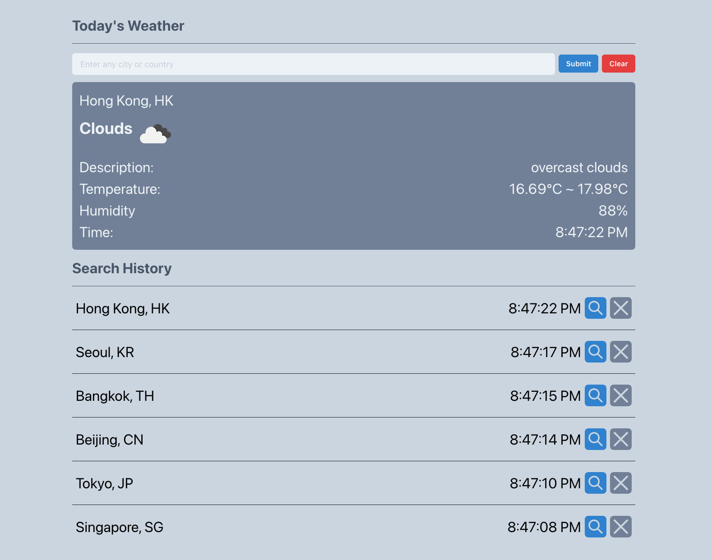
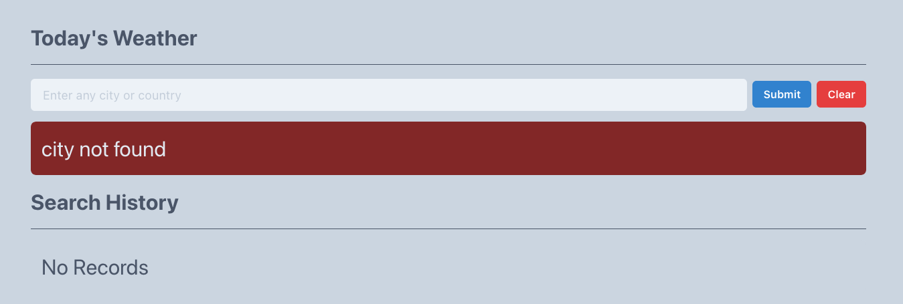

<!-- TABLE OF CONTENTS -->
## Table of Contents

- [Overview](#overview)
  - [Built With](#built-with)
  - [Features](#features)
  - [How to use](#how-to-use)
  - [Contact](#contact)

## Overview

This weather app was bootstrapped with [Create React App](https://github.com/facebook/create-react-app).

[Live Demo](https://weather-app-01f6fb.netlify.app/)

#### Search for city or country


#### No city found


### Features
- User can search for cities and countries upon pressing `Enter` or clicking `Submit` button
- User can clear inputs on clicking `Clear` button
- User can view the weather if city or country is keyed correctly
- User can track their search history
- User can query again from search history
- User can remove past searches from search history

## How To Use

<!-- Example: -->
To clone and run this application, you'll need [Git](https://git-scm.com) and [Node.js](https://nodejs.org/en/download/) (which comes with [npm](http://npmjs.com)) installed on your computer. From your command line:

```bash
# Clone this repository
$ git clone https://github.com/your-user-name/your-project-name

# Install dependencies
$ npm install

# Run the app
$ npm start
```

### Built With
- [Chakra UI](https://chakra-ui.com/)
- [React](https://reactjs.org/)
- [OpenWeather API](https://openweathermap.org/)

## Contact
- GitHub [@zxlvera](https://github.com/zxlvera)
- [LinkedIn](https://www.linkedin.com/in/zxlvera/)

